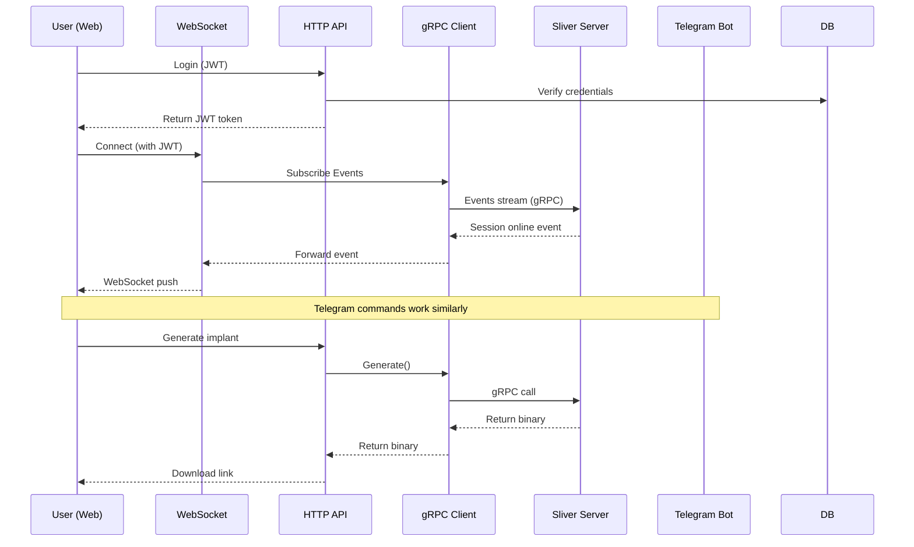
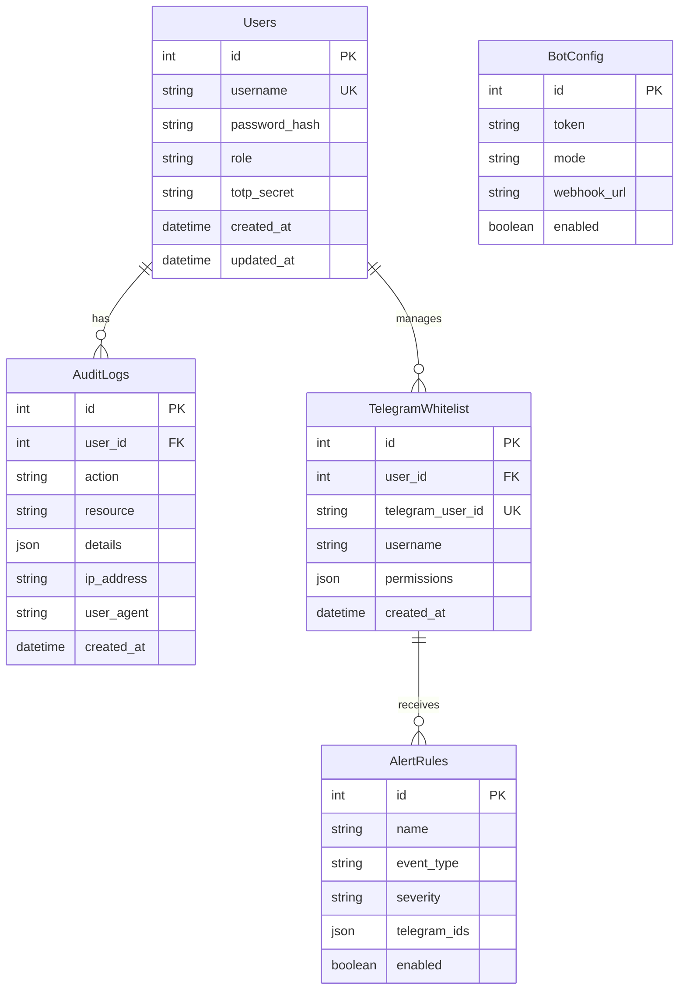
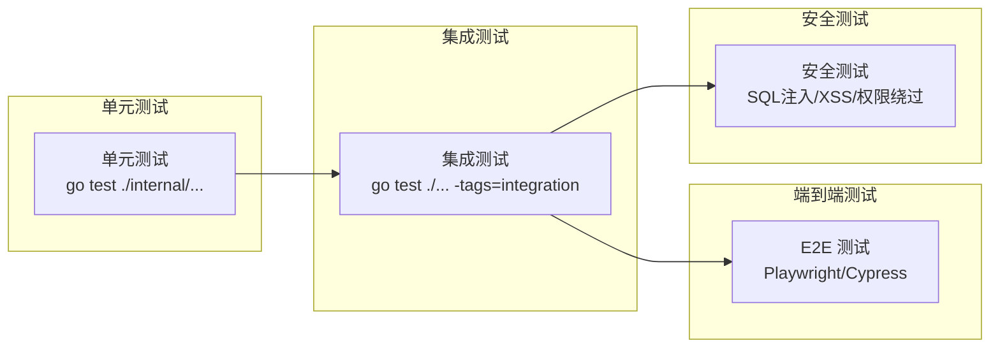

# Sliver Web UI - 技术设计规格说明书

需求名称：2026-03-27-sliver-web-ui
更新日期：2026-03-27
版本：v1.0

---

## 1. 概述

### 1.1 项目背景

Sliver 是一款开源的跨平台对抗模拟/红队框架，支持 C2 通信over Mutual TLS、WireGuard、HTTP(S) 和 DNS。当前 Sliver 仅提供 CLI 客户端操作界面，本项目旨在开发一套完整的 Web 可视化管理界面，降低使用门槛，提升操作效率。

### 1.2 核心目标

| 目标 | 说明 |
|------|------|
| 功能完整 | 100% 覆盖 Sliver 原生 gRPC API，无功能阉割 |
| 双端互通 | Web 界面与 Telegram Bot 操作同步，权限统一 |
| 安全合规 | RBAC 权限管控、TOTP 双因素认证、审计日志 |
| 快速部署 | Docker 一键部署，开箱即用 |

### 1.3 兼容性声明

- 兼容 Sliver 最新稳定版（v1.5.x）
- 兼容 Go 1.21+
- 兼容 React 18+

---

## 2. 系统架构

### 2.1 整体架构

```mermaid
graph TB
    subgraph "Sliver Server (Existing)"
        SVR["Sliver Server<br/>:50050 (gRPC)"]
        CERT["TLS Certificates<br/>/root/.sliver/certs"]
    end
    
    subgraph "Sliver-Web System"
        subgraph "Backend (Go)"
            API["HTTP API Server<br/>:8080"]
            WS["WebSocket Server<br/>:8080/ws"]
            RPC["gRPC Client<br/>Sliver RPC"]
            BOT["Telegram Bot<br/>Handler"]
        end
        
        subgraph "Data Layer"
            DB[(SQLite3<br/>users/permissions<br/>audit_logs)]
        end
    end
    
    subgraph "Frontend (React)"
        WEB["React App<br/>Ant Design 5.x"]
        STORE["Redux Toolkit<br/>State Management"]
    end
    
    subgraph "Telegram"
        TG["Telegram Users<br/>White List Only"]
    end
    
    WEB <-->|"HTTP REST"| API
    WEB <-->|"WebSocket| WS
    WS <-->|"Event Stream"| RPC
    API <-->|"gRPC + mTLS"| SVR
    API <-->|"HTTP Bot API"| TG
    RPC -->|"Use Shared| CERT
    
    style SVR fill:#ff6b6b,color:#000
    style DB fill:#4ecdc4,color:#000
    style WEB fill:#45b7d1,color:#000
```

### 2.2 组件交互流程



### 2.3 技术选型

| 组件 | 技术选型 | 版本要求 | 说明 |
|------|----------|----------|------|
| 后端语言 | Go | 1.21+ | 与 Sliver 技术栈一致 |
| Web 框架 | Gin | v1.9+ | 高性能 HTTP 框架 |
| 前端框架 | React | 18+ | 组件化开发 |
| UI 组件库 | Ant Design | 5.x | 企业级 UI |
| 状态管理 | Redux Toolkit | 2.x | 推荐方案 |
| 数据库 | SQLite3 | 3.x | 轻量免部署 |
| 实时通信 | WebSocket | - | 会话状态推送 |
| Telegram | tgbotapi | - | Bot 开发库 |
| 容器化 | Docker | 24.x | 一键部署 |

### 2.4 目录结构

```
sliver-web/
├── cmd/
│   └── server/
│       └── main.go              # 主入口
├── internal/
│   ├── api/
│   │   ├── handlers/            # HTTP 处理函数
│   │   │   ├── auth.go          # 认证接口
│   │   │   ├── session.go       # 会话接口
│   │   │   ├── beacon.go        # Beacon 接口
│   │   │   ├── listener.go      # 监听器接口
│   │   │   ├── implant.go       # 植入体接口
│   │   │   ├── loot.go          # 战利品接口
│   │   │   └── bot.go           # Bot 配置接口
│   │   ├── middleware/
│   │   │   ├── auth.go          # JWT 鉴权
│   │   │   ├── rbac.go          # 权限控制
│   │   │   ├── ratelimit.go     # 频率限制
│   │   │   └── logging.go       # 日志记录
│   │   └── router.go            # 路由定义
│   ├── rpc/
│   │   ├── client.go            # gRPC 客户端封装
│   │   ├── connection.go        # 连接管理
│   │   └── services/            # 各服务接口
│   │       ├── session.go
│   │       ├── beacon.go
│   │       ├── listener.go
│   │       ├── implant.go
│   │       └── interactive.go
│   ├── bot/
│   │   ├── server.go            # Bot 服务
│   │   ├── handlers/
│   │   │   ├── start.go         # /start 命令
│   │   │   ├── session.go       # /sessions 命令
│   │   │   ├── beacon.go        # /beacons 命令
│   │   │   ├── exec.go          # /exec 命令
│   │   │   └── generate.go      # /generate 命令
│   │   ├── inline/
│   │   │   └── keyboards.go     # Inline Keyboard
│   │   └── notifications/
│   │       └── pusher.go        # 告警推送
│   ├── ws/
│   │   ├── server.go            # WebSocket 服务
│   │   ├── client.go            # Sliver 事件订阅
│   │   └── hub.go               # 连接管理
│   ├── db/
│   │   ├── database.go          # 数据库初始化
│   │   ├── models/
│   │   │   ├── user.go
│   │   │   ├── telegram.go
│   │   │   └── audit.go
│   │   └── repository/
│   │       ├── user.go
│   │       └── audit.go
│   └── core/
│       ├── auth.go              # 认证核心逻辑
│       ├── totp.go              # TOTP 验证
│       └── encryption.go        # 加密工具
├── web/                         # React 前端
│   ├── public/
│   ├── src/
│   │   ├── components/         # 通用组件
│   │   │   ├── Layout/
│   │   │   ├── SessionList/
│   │   │   ├── BeaconTree/
│   │   │   └── InteractiveShell/
│   │   ├── pages/               # 页面
│   │   │   ├── Dashboard/
│   │   │   ├── Sessions/
│   │   │   ├── Beacons/
│   │   │   ├── Listeners/
│   │   │   ├── Generate/
│   │   │   ├── Loot/
│   │   │   ├── Settings/
│   │   │   └── Login/
│   │   ├── services/            # API 调用
│   │   │   ├── api.ts
│   │   │   └── websocket.ts
│   │   ├── stores/               # Redux store
│   │   │   ├── store.ts
│   │   │   ├── sessionSlice.ts
│   │   │   ├── beaconSlice.ts
│   │   │   └── authSlice.ts
│   │   ├── hooks/               # 自定义 Hooks
│   │   ├── utils/               # 工具函数
│   │   ├── types/               # TypeScript 类型
│   │   └── App.tsx
│   ├── package.json
│   └── vite.config.ts
├── certs/                       # TLS 证书（复用 Sliver）
│   └── sliver-web.conf
├── docker/
│   ├── Dockerfile
│   └── docker-compose.yml
├── Makefile
├── go.mod
└── README.md
```

---

## 3. 组件与接口设计

### 3.1 Sliver gRPC 客户端封装

#### 3.1.1 连接管理

```go
// internal/rpc/client.go
type SliverClient struct {
    conn   *grpc.ClientConn
    client rpcpb.SliverRPCClient
    mut    sync.RWMutex
    
    // 证书路径（复用 Sliver server 证书）
    certsDir string
}

func NewSliverClient(certsDir string) (*SliverClient, error) {
    // 加载 mTLS 证书
    certFile := filepath.Join(certsDir, "client.crt")
    keyFile := filepath.Join(certsDir, "client.key")
    caFile := filepath.Join(certsDir, "ca.crt")
    
    creds, err := credentials.NewTLS(certFile, keyFile, caFile)
    if err != nil {
        return nil, fmt.Errorf("failed to load TLS config: %w", err)
    }
    
    conn, err := grpc.Dial(
        *sliverAddr,
        grpc.WithTransportCredentials(creds),
        grpc.WithKeepaliveParams(kap),
    )
    if err != nil {
        return nil, fmt.Errorf("failed to connect to sliver server: %w", err)
    }
    
    return &SliverClient{
        conn:    conn,
        client:  rpcpb.NewSliverRPCClient(conn),
        certsDir: certsDir,
    }, nil
}
```

#### 3.1.2 服务接口映射

| Sliver gRPC 方法 | 封装函数 | Web API 端点 |
|-----------------|----------|--------------|
| GetSessions | GetAllSessions() | GET /api/sessions |
| Kill | KillSession(id) | DELETE /api/sessions/:id |
| Rename | RenameSession(id, name) | POST /api/sessions/:id/rename |
| GetBeacons | GetAllBeacons() | GET /api/beacons |
| GetBeaconTasks | GetBeaconTasks(id) | GET /api/beacons/:id/tasks |
| CancelBeaconTask | CancelTask(beaconID, taskID) | DELETE /api/beacons/:id/tasks/:tid |
| StartMTLSListener | StartMTLSListener(cfg) | POST /api/listeners/mtls |
| StartDNSListener | StartDNSListener(cfg) | POST /api/listeners/dns |
| StartHTTPSListener | StartHTTPSListener(cfg) | POST /api/listeners/https |
| GetJobs | GetAllJobs() | GET /api/listeners |
| KillJob | StopListener(jobID) | DELETE /api/listeners/:id |
| Generate | GenerateImplant(req) | POST /api/generate |
| ImplantProfiles | ListProfiles() | GET /api/profiles |
| SaveImplantProfile | SaveProfile(p) | POST /api/profiles |
| Ps | GetProcesses(sessID) | GET /api/sessions/:id/processes |
| Shell | StartShell(sessID, cols, rows) | WebSocket |
| Execute | ExecuteCommand(sessID, cmd) | POST /api/sessions/:id/exec |
| Ls | ListDirectory(sessID, path) | GET /api/sessions/:id/ls |
| Download | DownloadFile(sessID, path) | GET /api/sessions/:id/download |
| Upload | UploadFile(sessID, path, data) | POST /api/sessions/:id/upload |
| GetPrivs | GetPrivileges(sessID) | GET /api/sessions/:id/privs |
| MakeToken | MakeToken(sessID, user, pass) | POST /api/sessions/:id/token |
| Screenshot | TakeScreenshot(sessID) | GET /api/sessions/:id/screenshot |
| ProcessDump | DumpProcess(sessID, pid) | POST /api/sessions/:id/dump |
| RegistryRead | ReadRegistry(sessID, hive, key, val) | GET /api/sessions/:id/registry |
| Events | SubscribeEvents() | WebSocket stream |

### 3.2 HTTP API 设计

#### 3.2.1 认证接口

| 方法 | 路径 | 说明 | 权限 |
|------|------|------|------|
| POST | /api/auth/login | 用户登录 | 公开 |
| POST | /api/auth/2fa/verify | TOTP 验证 | 已登录 |
| POST | /api/auth/logout | 登出 | 已登录 |
| GET | /api/auth/profile | 获取用户信息 | 已登录 |
| PUT | /api/auth/password | 修改密码 | 已登录 |

**登录请求示例**：
```json
POST /api/auth/login
{
    "username": "admin",
    "password": "xxx"
}
```

**响应示例**：
```json
{
    "code": 200,
    "data": {
        "token": "eyJhbGciOiJIUzI1NiIs...",
        "expires_at": "2026-03-27T15:00:00Z",
        "user": {
            "id": 1,
            "username": "admin",
            "role": "super_admin"
        },
        "need_2fa": true
    }
}
```

#### 3.2.2 会话管理接口

| 方法 | 路径 | 说明 | 权限 |
|------|------|------|------|
| GET | /api/sessions | 会话列表 | operator+ |
| GET | /api/sessions/:id | 会话详情 | operator+ |
| DELETE | /api/sessions/:id | 杀死会话 | operator+ |
| POST | /api/sessions/:id/rename | 重命名会话 | operator+ |
| GET | /api/sessions/:id/processes | 进程列表 | operator+ |
| POST | /api/sessions/:id/exec | 执行命令 | operator+ |
| GET | /api/sessions/:id/ls | 列出目录 | operator+ |
| GET | /api/sessions/:id/download | 下载文件 | operator+ |
| POST | /api/sessions/:id/upload | 上传文件 | operator+ |
| GET | /api/sessions/:id/screenshot | 屏幕截图 | operator+ |
| GET | /api/sessions/:id/privs | 权限信息 | operator+ |
| POST | /api/sessions/:id/token | 创建令牌 | operator+ |
| POST | /api/sessions/:id/dump | 进程 dump | admin+ |
| POST | /api/sessions/:id/registry/read | 读注册表 | operator+ |
| POST | /api/sessions/:id/registry/write | 写注册表 | operator+ |

#### 3.2.3 Beacon 管理接口

| 方法 | 路径 | 说明 | 权限 |
|------|------|------|------|
| GET | /api/beacons | Beacon 列表 | operator+ |
| GET | /api/beacons/:id | Beacon 详情 | operator+ |
| GET | /api/beacons/:id/tasks | 任务队列 | operator+ |
| POST | /api/beacons/:id/task | 下发任务 | operator+ |
| DELETE | /api/beacons/:id/tasks/:tid | 取消任务 | operator+ |
| GET | /api/beacons/:id/tasks/:tid/output | 任务输出 | operator+ |

#### 3.2.4 监听器接口

| 方法 | 路径 | 说明 | 权限 |
|------|------|------|------|
| GET | /api/listeners | 监听器列表 | operator+ |
| POST | /api/listeners/mtls | 启动 MTLS | admin+ |
| POST | /api/listeners/wg | 启动 WireGuard | admin+ |
| POST | /api/listeners/dns | 启动 DNS | admin+ |
| POST | /api/listeners/http | 启动 HTTP | admin+ |
| POST | /api/listeners/https | 启动 HTTPS | admin+ |
| DELETE | /api/listeners/:id | 停止监听器 | admin+ |

**MTLS 监听器请求示例**：
```json
POST /api/listeners/mtls
{
    "name": "mtls-prod",
    "bind_address": "0.0.0.0:8888"
}
```

#### 3.2.5 Implant 生成接口

| 方法 | 路径 | 说明 | 权限 |
|------|------|------|------|
| GET | /api/profiles | Profile 列表 | operator+ |
| POST | /api/profiles | 创建 Profile | admin+ |
| PUT | /api/profiles/:id | 更新 Profile | admin+ |
| DELETE | /api/profiles/:id | 删除 Profile | admin+ |
| POST | /api/generate | 生成 Implant | operator+ |
| GET | /api/generate/download/:id | 下载 Implant | operator+ |

**Implant 生成请求示例**：
```json
POST /api/generate
{
    "profile_name": "windows-64-bit",
    "format": "exe",
    "platform": "windows",
    "arch": "amd64",
    "mtls": ["192.168.1.100:8888"],
    "dns": ["dns://8.8.8.8"],
    "http": ["https://C2Domain.com"],
    "interval": 60,
    "jitter": 10,
    "evasion": false,
    "name": "my-implant"
}
```

#### 3.2.6 Telegram Bot 配置接口

| 方法 | 路径 | 说明 | 权限 |
|------|------|------|------|
| GET | /api/bot/config | Bot 配置 | admin+ |
| PUT | /api/bot/config | 更新配置 | admin+ |
| POST | /api/bot/start | 启动 Bot | admin+ |
| POST | /api/bot/stop | 停止 Bot | admin+ |
| GET | /api/bot/whitelist | 白名单列表 | admin+ |
| POST | /api/bot/whitelist | 添加白名单 | admin+ |
| DELETE | /api/bot/whitelist/:id | 移除白名单 | admin+ |
| GET | /api/bot/alerts | 告警规则 | admin+ |
| POST | /api/bot/alerts | 创建告警规则 | admin+ |
| PUT | /api/bot/alerts/:id | 更新告警规则 | admin+ |
| DELETE | /api/bot/alerts/:id | 删除告警规则 | admin+ |

### 3.3 WebSocket 协议

#### 3.3.1 连接建立

```
GET /ws?token=<JWT>&type=web
Upgrade: websocket
```

#### 3.3.2 消息格式

**客户端发送**：
```json
{
    "action": "subscribe",
    "channels": ["sessions", "beacons", "tasks", "alerts"]
}
```

**服务端推送**：
```json
{
    "type": "event",
    "channel": "sessions",
    "data": {
        "event": "session:online",
        "session": {
            "id": "abc123",
            "name": "victim-pc",
            "hostname": "DESKTOP-XXX",
            "username": "admin",
            "os": "windows",
            "arch": "amd64",
            "remote_address": "192.168.1.100",
            "last_checkin": 1711544400
        }
    },
    "timestamp": "2026-03-27T10:00:00Z"
}
```

**事件类型**：

| 事件 | 说明 | 推送对象 |
|------|------|----------|
| session:online | 会话上线 | 所有在线用户 |
| session:offline | 会话离线 | 所有在线用户 |
| beacon:checkin | Beacon 签到 | 操作员+ |
| beacon:task_complete | 任务完成 | 下发者 |
| alert:session | 会话告警 | 管理员 |
| alert:security | 安全告警 | 管理员 |

#### 3.3.3 Shell 交互协议

**WebSocket 消息 - 打开 Shell**：
```json
{
    "action": "shell.open",
    "session_id": "abc123",
    "cols": 120,
    "rows": 40
}
```

**WebSocket 消息 - 发送输入**：
```json
{
    "action": "shell.input",
    "session_id": "abc123",
    "data": "ls -la\n"
}
```

**WebSocket 消息 - 调整大小**：
```json
{
    "action": "shell.resize",
    "session_id": "abc123",
    "cols": 160,
    "rows": 50
}
```

### 3.4 Telegram Bot 设计

#### 3.4.1 命令列表

| 命令 | 权限 | 功能描述 |
|------|------|----------|
| /start | 白名单 | 启动 Bot，权限校验，展示菜单 |
| /help | 白名单 | 显示所有命令帮助 |
| /sessions | operator+ | 列出活跃会话 |
| /beacons | operator+ | 列出所有 Beacon |
| /exec `<session_id>` `<cmd>` | operator+ | 执行命令 |
| /generate | admin | 快捷生成 Implant |
| /listener | admin | 监听器管理 |
| /alerts | operator+ | 查看告警记录 |
| /lock | super_admin | 锁定 Bot |

#### 3.4.2 Inline Keyboard 交互

**会话选择菜单**：
```
🖥️ 会话列表
━━━━━━━━━━━━━━━━
[DESKTOP-XXX@192.168.1.100]
[victim-web@10.0.0.5]
━━━━━━━━━━━━━━━━
```

点击会话后，后续命令自动使用该会话。

**Implant 生成菜单**：
```
🎯 快速生成
━━━━━━━━━━━━━━━━
[Windows EXE]
[Windows DLL]
[Linux ELF]
[macOS Mach-O]
━━━━━━━━━━━━━━━━
```

#### 3.4.3 告警推送格式

```
🚨 [严重告警] 会话上线
━━━━━━━━━━━━━━━━
👤 用户: admin
🖥️ 主机: DESKTOP-XXX
🌐 地址: 192.168.1.100
⏰ 时间: 2026-03-27 10:00:00
━━━━━━━━━━━━━━━━
```

---

## 4. 数据模型

### 4.1 数据库 ER 图



### 4.2 表结构定义

```sql
-- 用户表
CREATE TABLE users (
    id INTEGER PRIMARY KEY AUTOINCREMENT,
    username TEXT UNIQUE NOT NULL,
    password_hash TEXT NOT NULL,
    role TEXT NOT NULL CHECK(role IN ('super_admin', 'operator', 'auditor')),
    totp_secret TEXT,  -- AES-256 加密存储
    totp_enabled BOOLEAN DEFAULT 1,
    is_active BOOLEAN DEFAULT 1,
    created_at DATETIME DEFAULT CURRENT_TIMESTAMP,
    updated_at DATETIME DEFAULT CURRENT_TIMESTAMP
);

-- Telegram 白名单
CREATE TABLE telegram_whitelist (
    id INTEGER PRIMARY KEY AUTOINCREMENT,
    user_id INTEGER REFERENCES users(id),
    telegram_user_id TEXT UNIQUE NOT NULL,
    telegram_username TEXT,
    permissions TEXT,  -- JSON: ["sessions:read", "beacons:read", "exec:write"]
    is_active BOOLEAN DEFAULT 1,
    created_at DATETIME DEFAULT CURRENT_TIMESTAMP
);

-- Bot 配置
CREATE TABLE bot_config (
    id INTEGER PRIMARY KEY CHECK (id = 1),
    token TEXT,  -- AES-256 加密
    mode TEXT CHECK(mode IN ('polling', 'webhook')) DEFAULT 'polling',
    webhook_url TEXT,
    enabled BOOLEAN DEFAULT 0,
    locked BOOLEAN DEFAULT 0,
    updated_at DATETIME DEFAULT CURRENT_TIMESTAMP
);

-- 审计日志
CREATE TABLE audit_logs (
    id INTEGER PRIMARY KEY AUTOINCREMENT,
    user_id INTEGER REFERENCES users(id),
    action TEXT NOT NULL,
    resource TEXT NOT NULL,
    resource_id TEXT,
    details TEXT,  -- JSON
    ip_address TEXT,
    user_agent TEXT,
    created_at DATETIME DEFAULT CURRENT_TIMESTAMP
);

-- 告警规则
CREATE TABLE alert_rules (
    id INTEGER PRIMARY KEY AUTOINCREMENT,
    name TEXT NOT NULL,
    event_type TEXT NOT NULL,
    severity TEXT CHECK(severity IN ('info', 'warning', 'critical')) DEFAULT 'info',
    telegram_ids TEXT,  -- JSON array
    email_enabled BOOLEAN DEFAULT 0,
    email_recipients TEXT,
    enabled BOOLEAN DEFAULT 1,
    created_at DATETIME DEFAULT CURRENT_TIMESTAMP
);

-- 索引
CREATE INDEX idx_audit_logs_user ON audit_logs(user_id);
CREATE INDEX idx_audit_logs_action ON audit_logs(action);
CREATE INDEX idx_audit_logs_created ON audit_logs(created_at);
CREATE INDEX idx_telegram_whitelist_tgid ON telegram_whitelist(telegram_user_id);
```

### 4.3 API 响应格式

```go
type Response struct {
    Code    int         `json:"code"`
    Message string      `json:"message,omitempty"`
    Data    interface{} `json:"data,omitempty"`
    Meta    *Meta       `json:"meta,omitempty"`
}

type Meta struct {
    Page       int `json:"page,omitempty"`
    PageSize   int `json:"page_size,omitempty"`
    Total      int `json:"total,omitempty"`
}
```

**分页响应示例**：
```json
{
    "code": 200,
    "data": [...],
    "meta": {
        "page": 1,
        "page_size": 20,
        "total": 100
    }
}
```

---

## 5. 正确性属性

### 5.1 功能正确性

| 属性 | 说明 | 验证方式 |
|------|------|----------|
| API 覆盖完整性 | 所有 Sliver gRPC 方法均有对应 API | 自动化接口测试 |
| 会话同步一致性 | Web 与 Bot 操作同一会话结果一致 | 集成测试 |
| 任务下发可靠性 | Beacon 任务不丢失，支持断线重连 | 压力测试 |
| 文件传输完整性 | 上传下载文件哈希校验 | 单元测试 |

### 5.2 安全性正确性

| 属性 | 说明 | 验证方式 |
|------|------|----------|
| 认证有效性 | JWT/TOTP 验证通过方可操作 | 安全测试 |
| 权限隔离性 | 低权限用户无法执行高权限操作 | 权限测试 |
| 审计可追溯性 | 所有操作均有日志记录 | 审计测试 |
| 敏感数据保护 | 密码/Token 加密存储 | 代码审计 |

### 5.3 可靠性正确性

| 属性 | 说明 | 验证方式 |
|------|------|----------|
| 连接恢复 | Sliver Server 断线后自动重连 | 容错测试 |
| 并发安全性 | 多用户同时操作不冲突 | 并发测试 |
| 资源清理 | 会话关闭后资源正确释放 | 内存测试 |

---

## 6. 错误处理

### 6.1 错误码定义

| 错误码 | HTTP 状态码 | 说明 |
|--------|-------------|------|
| 10001 | 401 | 认证失败 |
| 10002 | 401 | Token 过期 |
| 10003 | 401 | TOTP 验证失败 |
| 10004 | 403 | 权限不足 |
| 10005 | 404 | 资源不存在 |
| 10006 | 409 | 资源冲突 |
| 10007 | 422 | 参数验证失败 |
| 10008 | 500 | Sliver RPC 错误 |
| 10009 | 503 | Sliver Server 不可用 |

### 6.2 错误响应格式

```json
{
    "code": 10004,
    "message": "权限不足，需要 admin 权限",
    "details": {
        "required_role": "admin",
        "current_role": "operator"
    },
    "request_id": "req_abc123"
}
```

### 6.3 重试机制

| 场景 | 重试策略 | 最大重试次数 |
|------|----------|--------------|
| Sliver RPC 调用失败 | 指数退避 1s, 2s, 4s | 3 |
| 网络连接断开 | 立即重连 + 指数退避 | 5 |
| Token 刷新 | 同步重试 | 1 |
| 文件上传 | 断点续传 | 3 |

### 6.4 异常处理策略

```go
// 全局异常处理中间件
func ErrorHandler() gin.HandlerFunc {
    return func(c *gin.Context) {
        defer func() {
            if err := recover(); err != nil {
                log.Error("panic recovered: %v", err)
                c.JSON(500, Response{
                    Code:    10000,
                    Message: "内部错误",
                    RequestID: c.GetString("request_id"),
                })
            }
        }()
        c.Next()
    }
}

// Sliver RPC 错误转换
func mapSliverError(err error) *AppError {
    if status, ok := status.FromError(err); ok {
        switch status.Code() {
        case codes.Unauthenticated:
            return &AppError{Code: 10001, Message: "认证失败"}
        case codes.PermissionDenied:
            return &AppError{Code: 10004, Message: "权限不足"}
        case codes.NotFound:
            return &AppError{Code: 10005, Message: "资源不存在"}
        default:
            return &AppError{Code: 10008, Message: status.Message()}
        }
    }
    return &AppError{Code: 10008, Message: "Sliver RPC 调用失败"}
}
```

---

## 7. 测试策略

### 7.1 测试分层



### 7.2 测试覆盖要求

| 模块 | 覆盖率要求 | 关键测试用例 |
|------|------------|--------------|
| RPC 封装 | ≥90% | gRPC 方法映射、错误转换 |
| API 路由 | ≥85% | 参数校验、权限校验 |
| 认证模块 | ≥95% | JWT 生成/验证、TOTP |
| Bot 处理器 | ≥80% | 命令解析、权限校验 |
| WebSocket | ≥85% | 连接管理、消息推送 |

### 7.3 测试环境

```yaml
# docker-compose.test.yml
services:
  sliver-test:
    image: bishopfox/sliver-server:stable
    ports:
      - "50050:50050"
    
  sliver-web-test:
    build: .
    environment:
      - SLIVER_GRPC_ADDR=sliver-test:50050
      - TEST_MODE=1
    depends_on:
      - sliver-test
```

### 7.4 性能测试指标

| 指标 | 目标值 |
|------|--------|
| API P99 延迟 | < 200ms |
| WebSocket 消息延迟 | < 50ms |
| 并发用户数 | ≥ 100 |
| 会话列表刷新 | < 500ms |

---

## 8. 部署方案

### 8.1 Docker 部署

```yaml
# docker-compose.yml
version: '3.8'

services:
  sliver-server:
    image: bishopfox/sliver-server:stable
    container_name: sliver-server
    ports:
      - "50050:50050"
      - "80:80"
      - "443:443"
    volumes:
      - sliver-data:/root/.sliver
    restart: unless-stopped

  sliver-web:
    build:
      context: .
      target: production
    container_name: sliver-web
    ports:
      - "8080:8080"
    environment:
      - SLIVER_GRPC_ADDR=sliver-server:50050
      - SLIVER_CERTS_DIR=/certs
      - DB_PATH=/data/sliver-web.db
      - JWT_SECRET=${JWT_SECRET}
    volumes:
      - sliver-data/certs:/certs:ro
      - sliver-web-data:/data
    depends_on:
      - sliver-server
    restart: unless-stopped

volumes:
  sliver-data:
  sliver-web-data:
```

### 8.2 环境变量配置

| 变量名 | 说明 | 示例 |
|--------|------|------|
| SLIVER_GRPC_ADDR | Sliver Server 地址 | sliver-server:50050 |
| SLIVER_CERTS_DIR | 证书目录 | /certs |
| DB_PATH | 数据库路径 | /data/sliver-web.db |
| JWT_SECRET | JWT 密钥 | (需随机生成) |
| LOG_LEVEL | 日志级别 | info/debug |
| BOT_MODE | Bot 运行模式 | polling/webhook |

### 8.3 初始化流程

1. 启动 Sliver Server
2. 首次登录 Web，创建管理员账号
3. 配置 Sliver gRPC 证书路径
4. 配置 Telegram Bot Token
5. 添加 Telegram 白名单用户
6. 设置告警规则

---

## 9. 关键技术决策

| 决策点 | 选择 | 理由 |
|--------|------|------|
| 证书复用 | 复用 Sliver Server 证书 | 简化部署，无需额外 CA |
| 前端状态管理 | Redux Toolkit | 官方推荐，生态完善 |
| Bot 消息持久化 | 不持久化 | 减少存储复杂度 |
| 数据库 | SQLite3 | 轻量，满足需求，无额外依赖 |
| 实时通信 | WebSocket | 低延迟，支持双向通信 |

---

## 10. 参考链接

[^1]: [Sliver Documentation](https://sliver.sh/docs)
[^2]: [Sliver GitHub](https://github.com/BishopFox/sliver)
[^3]: [Sliver gRPC API](https://github.com/BishopFox/sliver/blob/master/protobuf/rpcpb/services.proto)
[^4]: [Gin Web Framework](https://gin-gonic.com/)
[^5]: [Ant Design 5.x](https://ant.design/)
[^6]: [Redux Toolkit](https://redux-toolkit.js.org/)
[^7]: [Telegram Bot API](https://core.telegram.org/bots/api)
